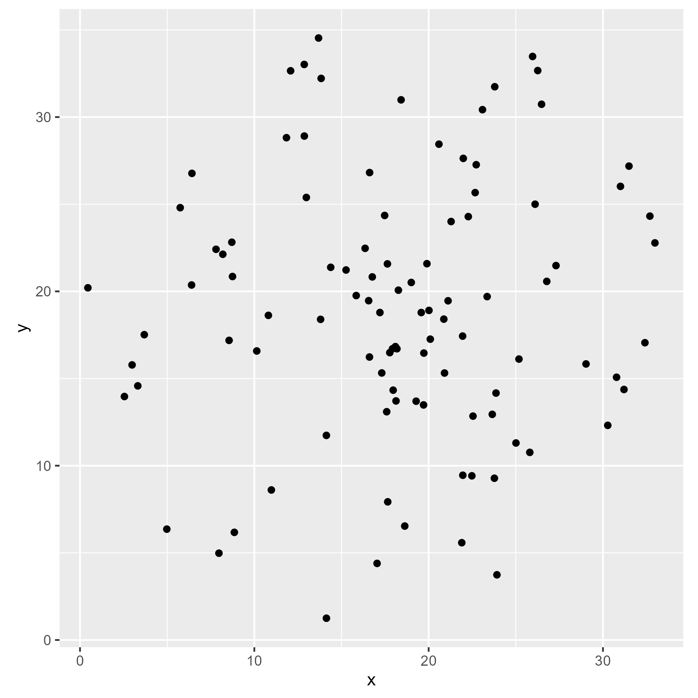

# ForestSDC  <a href='https://github.com/rubio-e/ForestSDC'></a>

**ForestSDC**: *Forest stand Structure, tree Diversity, and species Composition*
<!-- badges: start -->
[](https://github.com/rubio-e/ForestSDC)
[](./LICENSE.md)
<!-- badges: end -->

## Descripción

**ForestSDC** es un paquete de R diseñado para facilitar el análisis de inventarios forestales y parcelas permanentes de investigación. Incluye herramientas para calcular índices estructurales, métricas de biodiversidad y estadísticas de vecinos más cercanos, apoyando investigaciones sobre dinámica forestal, salud del ecosistema y diversidad biológica.

## Características principales

- Cálculo de índices de diversidad (Shannon, Simpson, Margalef, Menhinick, Pielou, etc.).
- Análisis estructural: área basal, altura dominante, densidad de arbolado, índice BAL y BALMOD.
- Cálculo de índices espaciales con vecinos más cercanos en parcelas circulares (`nnss_circle`) y cuadradas (`nnss_square`).
- Clasificación de árboles dominantes y distribución diamétrica.

## Instalación

```r
# Instala devtools si no lo tienes
install.packages("devtools")

# Instala ForestSDC desde GitHub
devtools::install_github("rubio-e/ForestSDC")
```

## Uso básico de ForestSDC
La librería cuenta con bases de datos reales que pueden ser utilizados para practicar.

```r
library(ForestSDC)
# Cálculo del índice de Shannon
library(ForestSDC)
data("pipse_azimuth")
head(pipse_azimuth)
```
```r
##   plot    sp    d    h   azimuth  distance
## 1  P01 QUCAN 13.9  7.2 277.74297 17.548594
## 2  P01 PIPSE 22.7 15.1 136.72114  6.862664
## 3  P01 PRSER 10.9  3.9 160.80413  4.384468
## 4  P01 PIPSE 11.0  8.0 165.87053  1.040388
## 5  P01 PIPSE  8.0  6.4  63.67683  3.653111
## 6  P01 PIPSE 31.3 12.2  61.43844  1.977114
```

## Diversidad de especies
El cálculo de índices de diversidad en sitios individuales se puede llevar a cabo siguiendo el estándar de la programación en R. Por ejemplo, para calcular el índice de entropía de Shannon se puede utilizar la función `shannon`.
```r
shannon(pipse_azimuth$sp)
[1] 1.542215
```

Este procedimiendo se puede seguir para los otros índices como el de `Simpson` o `Margalef`.
```r
margalef(pipse_azimuth$sp)
[1] 1.737178

simpson(pipse_azimuth$sp)
[1] 0.2862
```

## Composición de especies

```r
data("pipse_cplot")
ivi_index_table(sp = sp, x = ca, plot = plot, data = pipse_cplot, plot_area = 1000)
```

```r
## # A tibble: 13 × 9
##    sp       Nha     Xha Plots Abundance Dominance Frequency    IVI  rank
##    <chr>  <dbl>   <dbl> <int>     <dbl>     <dbl>     <dbl>  <dbl> <int>
##  1 PIPSE 248    7126.      30    42.7     52.0        13.9  36.2       1
##  2 QUCAN 105    2741.      30    18.1     20.0        13.9  17.3       2
##  3 JUFLA  95.7  1611.      30    16.5     11.8        13.9  14.0       3
##  4 QURIZ  48     953.      28     8.26     6.95       13.0   9.39      4
##  5 ARXAL  29.7   379.      27     5.11     2.76       12.5   6.79      5
##  6 CAMYR  21     306.      23     3.61     2.24       10.6   5.50      6
##  7 QUPOL  21.3   479.      19     3.67     3.50        8.80  5.32      7
##  8 PRSER   3.67   10.3      7     0.631    0.0753      3.24  1.32      8
##  9 PRLAE   2       9.05     6     0.344    0.0660      2.78  1.06      9
## 10 MITEX   3      18.1      5     0.516    0.132       2.31  0.988    10
## 11 ACCOU   1.67   16.0      5     0.287    0.117       2.31  0.906    11
## 12 QULAC   1      43.0      3     0.172    0.314       1.39  0.625    12
## 13 MADE    1      14.2      3     0.172    0.104       1.39  0.555    13
```
Los índices se pueden calcular para cada uno de los sitios utilizando la librería dplyr.
```r
require(dplyr)

pipse_cplot %>%
  group_by(plot) %>%
  reframe(a_index = A_index(x = h, y = sp), H = shannon(sp), hdom = h_dom(h = h, d = d, ps = 1000))
```

```r
## # A tibble: 30 × 4
##     plot a_index     H  hdom
##    <int>   <dbl> <dbl> <dbl>
##  1     1    1.94  1.49  13.5
##  2     2    2.54  1.48  11.8
##  3     3    1.94  1.39  13.5
##  4     4    2.06  1.22  13.4
##  5     5    2.58  1.63  12.2
##  6     6    2.65  1.39  11.6
##  7     7    2.51  1.53  13.2
##  8     8    1.63  1.59  14.3
##  9     9    2.12  1.51  14.4
## 10    10    2.27  1.46  12.0
## # ℹ 20 more rows
```

## 📊 Funciones destacadas: Análisis de Vecinos más Cercanos

### Coordenadas
También incluye funciones para estimar las coordenadas x y y con datos de distancia y azimut con la funcióncoord_xy, la cuál puede ser utilizada de forma directa.
```r
coord_xy(azi = 180, dis = 2, r = 17.84*2)
##       x     y
## 1 17.84 15.84
```
### 📈 Ejemplos con dplyr
utilizando la función mutate de la librería dplyr.
```r
require(dplyr)
pipse_xy <- 
pipse_azimuth %>% 
    mutate(coord_xy(azi = azimuth,dis = distance, r = 17.84*2))
head(pipse_xy)
##   plot    sp    d    h   azimuth  distance          x        y
## 1  P01 QUCAN 13.9  7.2 277.74297 17.548594  0.4514071 20.20431
## 2  P01 PIPSE 22.7 15.1 136.72114  6.862664 22.5446978 12.84380
## 3  P01 PRSER 10.9  3.9 160.80413  4.384468 19.2816067 13.69931
## 4  P01 PIPSE 11.0  8.0 165.87053  1.040388 18.0939731 16.83109
## 5  P01 PIPSE  8.0  6.4  63.67683  3.653111 21.1143096 19.45991
## 6  P01 PIPSE 31.3 12.2  61.43844  1.977114 19.5765068 18.78526
```
### 📈 Distrubución espacial con ggplot
Ahora, estos datos los podemos graficar con la librería ggplot2 para revisar su distribución espacial.
```r
require(ggplot2)
ggplot(pipse_xy, aes(x = x, y = y))+
  geom_point()+
  coord_fixed()
```

<a></a>

Incluso se pueden hacer modificaciones para colorear con base en la especie y escalar con el diámetro.

```r
ggplot(pipse_xy, aes(x = x, y = y))+
  geom_point(aes(colour = sp, size = d))+
  coord_fixed()
```

## Análisis espacial
### 📈 sitios circulares
A continuación se muestra un ejemplo del cálculo de los índices de vecindad con la función nnss_circle. 
Esta función se aplica solamente a sitios circulares y requiere de conocer el radio del sitio. En el ejemplo se 
muestra un sitio de 1000 metros cuadrados con radio de 17.84.
```r
pipse_nnss <-
nnss_circle(x = x, y = y, sp = sp, d = d, h = h, r = 17.84, data = pipse_xy)

head(pipse_nnss)
```

```r
##           xc       yc          x        y    sp    d    h   Ui   Mi dDomi hDomi
## 1  0.4514071 20.20431  0.4514071 20.20431 QUCAN 13.9  7.2 1.00 0.75  0.50  0.25
## 2 22.5446978 12.84380 22.5446978 12.84380 PIPSE 22.7 15.1 0.50 0.25  0.50  1.00
## 3 19.2816067 13.69931 19.2816067 13.69931 PRSER 10.9  3.9 0.50 1.00  0.25  0.00
## 4 18.0939731 16.83109 18.0939731 16.83109 PIPSE 11.0  8.0 0.75 0.25  0.25  0.00
## 5 21.1143096 19.45991 21.1143096 19.45991 PIPSE  8.0  6.4 0.75 0.50  0.00  0.00
## 6 19.5765068 18.78526 19.5765068 18.78526 PIPSE 31.3 12.2 0.75 0.50  1.00  0.75
##        dDif      hDif NN1
## 1 0.2673575 0.3004503   0
## 2 0.2515234 0.4023179   1
## 3 0.2719935 0.5832759   1
## 4 0.4142823 0.3776968   1
## 5 0.4560715 0.2597615   1
## 6 0.5115815 0.2868852   1
```

En el siguiente ejemplo se muestra la distribución de los árboles que pueden ser árbol central [1] y los que no [0]. 
Esto se calcula con el efecto de borde a través del algoritmo NN1.
```r
require(ggplot2)

ggplot(pipse_nnss, aes(x,y))+
  geom_point(aes(colour = factor(NN1)))+
  theme_bw()
```

### 📈 Efecto de borde NN1 vs Tradicional
En este ejemplo se utiliza la variable center_point que indica las coordenadas centrales del sitio de muestreo.
Esto es útil para sitios con coordenadas centrales diferentes al radio.
```r
library(ggforce) # For drawing the circle
data("pipse_cplot")
pipse_cplot1 <- pipse_cplot[pipse_cplot$plot == 1, ]

pipse_cplot1n <-
  nnss_circle(x = x, y = y, sp = sp, d = d, h = h, r = 17.84124, data = pipse_cplot1,
    center_point = cbind((pipse_cplot1$x_center), (pipse_cplot1$y_center)))

plot_radius <- 17.84

ggplot(pipse_cplot1n, aes(x = xc, y = yc)) +
  geom_point(aes(colour = as.factor(NN1))) +
  geom_circle(aes(x0 = plot_radius, y0 = plot_radius, r = plot_radius)) +
  geom_circle(aes(x0 = plot_radius, y0 = plot_radius, r = plot_radius - 5)) +
  coord_fixed() +
  theme_bw() +
  theme_minimal()
```

---

## Dependencias

- `dplyr`
- `tidyr`
- `FNN`

## Autor

**Ernesto Rubio**  
📧 ernestorub@gmail.com

## Licencia

Este paquete está disponible bajo la licencia GPL >= 3.

## Cómo citar

> Rubio-Camacho, E. A. (2025). *ForestSDC: Forest stand Structure, tree Diversity and species Composition* (Version 0.1.0) [Software]. https://github.com/rubio-e/ForestSDC

---

> *ForestSDC permite análisis ecológicos y estructurales reproducibles en inventarios forestales, promoviendo el monitoreo de bosques sostenibles en distintas regiones del mundo.*
